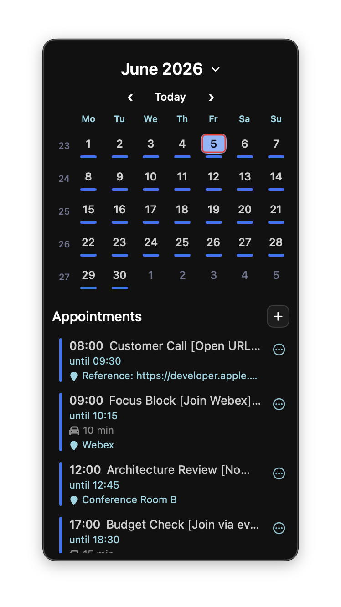
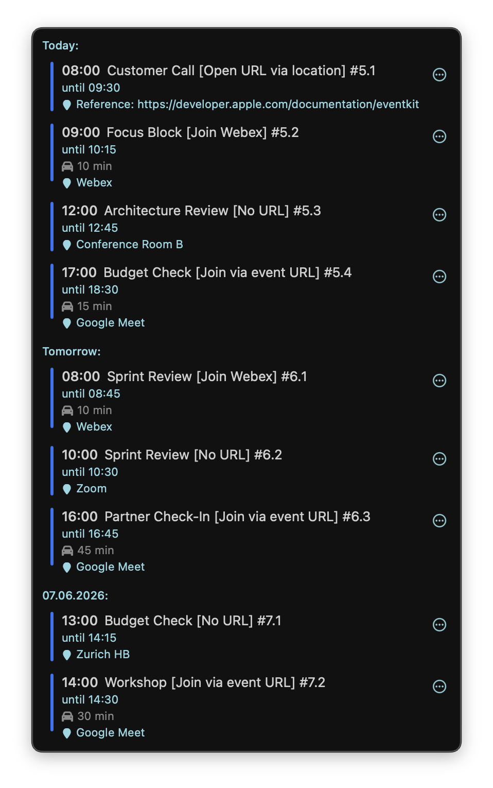
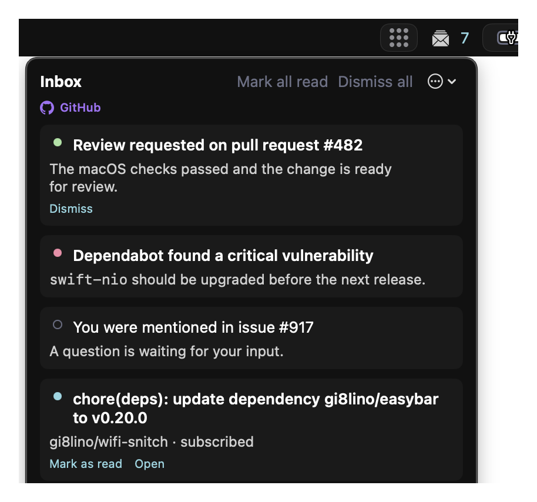
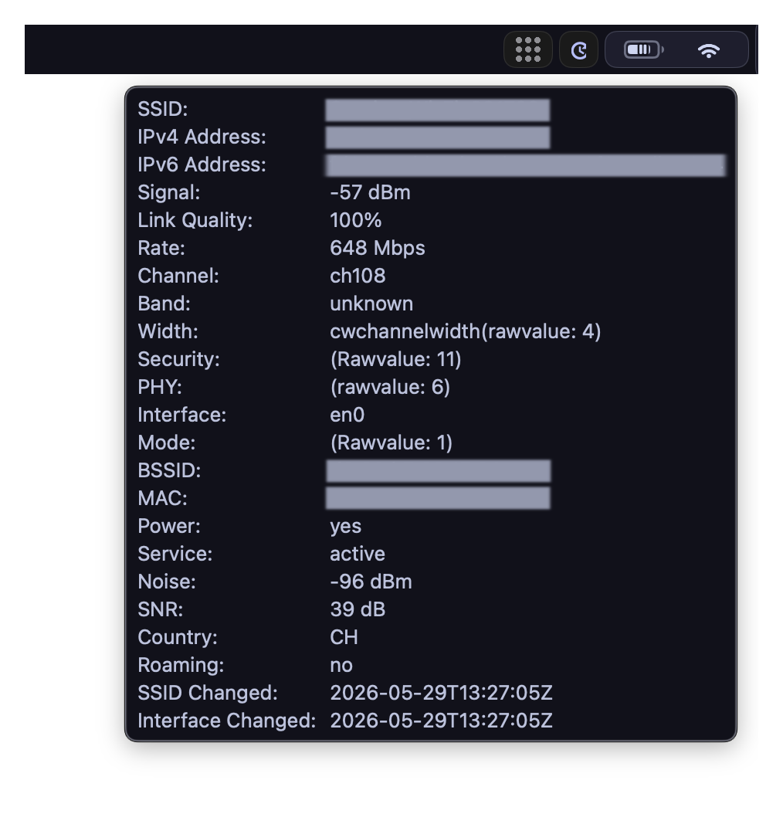
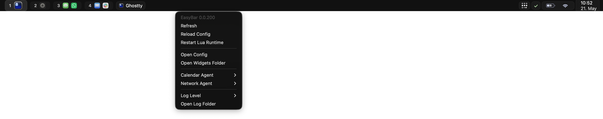
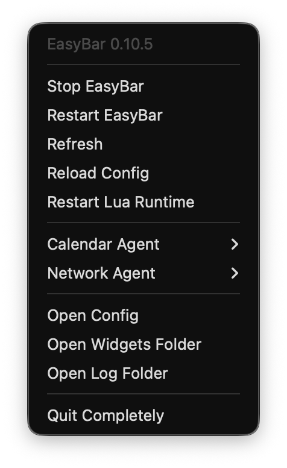

# EasyBar


EasyBar is a lightweight, scriptable macOS status bar built with SwiftUI and Lua.

It combines native built-in widgets with custom Lua widgets and is designed for an AeroSpace-based macOS workflow.

## Features

- Native macOS bar window built with SwiftUI
- Configurable native widgets for spaces, applications, system status, calendar, and more
- Object-style Lua widgets with events, timers, asynchronous commands, popups, and groups
- Native right-click context menus for built-in and Lua widgets
- Immediate, comment-preserving configuration updates from native context menus
- Shared native inbox with unread state, grouping, persistence, Markdown, and publisher actions
- File-based themes with bundled and custom TOML palettes
- AeroSpace integration for spaces, focused app state, and layout mode state
- Calendar and network helper agents for permission-sensitive macOS data
- Persistent menu bar controller and CLI commands for reloads, restarts, and diagnostics
- Homebrew cask installation into `/Applications` with separately managed agent services
- Config-driven logging, troubleshooting diagnostics, and lightweight runtime metrics

## Requirements

EasyBar v0.4.0 and newer require AeroSpace 0.21.0 or newer for AeroSpace-backed widgets. The integration reads AeroSpace state from formatted JSON output.

If you use v0.4.0 or newer, update and restart AeroSpace so both the CLI client and the running AeroSpace.app server are at least 0.21.0.

Check your installed AeroSpace versions with:

```bash
aerospace --version
```

## Installation

```bash
brew tap gi8lino/tap
brew install --cask gi8lino/tap/easybar
```

Launch EasyBar from Finder, Spotlight, or the command line:

```bash
open -a EasyBar
```

## Documentation

Full documentation is available here: [https://gi8lino.github.io/easybar/](https://gi8lino.github.io/easybar/)

Start with:

- Installation
- Configuration
- Themes
- AeroSpace Integration
- Lua Widgets
- Runtime Control
- Troubleshooting
- Architecture

## Configuration

EasyBar can start without a custom config file. Create one only when you want to override the built-in defaults.

When present, EasyBar reads its runtime config from:

```text
~/.config/easybar/config.toml
```

You can override it with:

```bash
EASYBAR_CONFIG_PATH=/path/to/config.toml
```

The repository includes:

- [`config.defaults.toml`](./config.defaults.toml) for the complete default reference
- [`config.minimal.toml`](./config.minimal.toml) for a small optional starter override

Themes are selected in `config.toml`:

```toml
[theme]
name = "default"
themes_dir = "~/.config/easybar/themes"
```

EasyBar first looks for a custom theme in `themes_dir`, then falls back to bundled themes.

## Developing

### Install development tools

Install Lua, StyLua, and rustup before running the contributor checks:

```bash
brew install lua stylua rustup
export PATH="$(brew --prefix rustup)/bin:$PATH"
rustup default stable
rustup target add aarch64-apple-darwin x86_64-apple-darwin
```

EasyBar links a small Rust `toml_edit` bridge into every executable so configuration parsing and
comment-preserving updates use the same TOML implementation. Both Rust targets are required for
universal release builds; `make test` only builds the selected local architecture.

The repository-level `.stylua.toml` is the source of truth for Lua formatting. `make fmt` and
`make lint` use the `stylua` executable from `PATH`.

### Test the release bundles

Build the local ad-hoc-signed bundles and launch the standalone agents before the main app:

```bash
make bundle ARCH=arm64 VERSION=dev
open -g dist/EasyBarCalendarAgent.app
open -g dist/EasyBarNetworkAgent.app
open dist/EasyBar.app
```

The calendar and network helpers are standalone application bundles installed through separate Homebrew formulae and managed by Homebrew Services. EasyBar communicates with them over Unix sockets. The CLI remains a separate `dist/easybar` executable.

Restart helpers with `easybar --restart-calendar-agent`, `easybar --restart-network-agent`, or `easybar --restart-agents`.

### Install the current checkout for longer testing

Install the current checkout directly without creating a release and without first installing EasyBar through Homebrew:

```bash
make install-local
```

This builds release-mode artifacts for `LOCAL_INSTALL_ARCH` (which defaults to `RUN_ARCH`) and installs a standalone user-local setup:

```text
~/Applications/EasyBar.app
~/.local/bin/easybar
~/Library/Application Support/EasyBar/Agents/EasyBarCalendarAgent.app
~/Library/Application Support/EasyBar/Agents/EasyBarNetworkAgent.app
~/Library/LaunchAgents/io.github.gi8lino.easybar.local.*.plist
```

The helper agents run as normal user LaunchAgents, so no Homebrew EasyBar cask or agent formula is required. If released Homebrew agent services are already active, the installer stops them to prevent duplicate agents and leaves the released package files untouched.

`make install-local` automatically injects a Git-derived development version into the app, CLI, and helper agents. A clean checkout looks like:

```text
0.5.0-dev.218886be
```

Local tracked, staged, or untracked changes add `-dirty`:

```text
0.5.0-dev.218886be-dirty
```

Show the version that the next local installation will use without building anything:

```bash
make print-local-version
```

After installation, compare it with the CLI and the version shown by the bar menu or context menu:

```bash
make print-local-version
~/.local/bin/easybar --version
```

Before invoking SwiftPM, the build helper writes the selected version to the untracked `.build/easybar-build-version` input file. The SwiftPM plugin invokes the small `EasyBarGenerateBuildInfo` Swift tool, which reads that input and writes `BuildInfo` inside the plugin work directory. The file is rewritten only when the selected version changes, so repeated product builds do not invalidate SwiftPM unnecessarily. You can inspect the active compiler input directly with `cat .build/easybar-build-version`; a direct SwiftPM build with no version file falls back to `dev`.

The Lua API version is stamped only into the copied file under `dist/`. Local and release builds never rewrite tracked source files, so building does not create version-only changes that could be committed accidentally. Release builds remain unchanged from a user perspective and continue to write the version derived from the release tag before compiling in CI.

Repeat `make install-local` whenever you want to test a newer local state. Override any destination when needed:

```bash
make install-local LOCAL_INSTALL_ARCH=universal
make install-local LOCAL_APP_DIR=/Applications
make install-local LOCAL_BIN_DIR=/usr/local/bin
```

Make sure `~/.local/bin` is in `PATH` when using the default CLI location.

Remove the standalone build with:

```bash
make uninstall-local
```

The first local installation records whether each released Homebrew agent service was started, stopped, or absent. `make uninstall-local` restores those exact states after removing the local LaunchAgents.

Quickstart for contributors:

```bash
make fmt
make lint
make test
make stop
make run-debug
```

Useful build and runtime commands:

- `make verify-source-tree` checks required source, packaging, and Homebrew cask inputs.
- `make fmt` formats Swift and Lua sources.
- `make fmt-all` formats Swift, Lua, and Markdown sources.
- `make lint` checks Swift and Lua formatting without modifying files.
- `make test` runs the full Swift test suite without regenerating checked-in artifacts.
- `make build` builds the local app, agents, and CLI artifacts.
- `make run-debug` starts EasyBar with verbose logging for local debugging.
- `make install-local` installs the current release-mode checkout with a Git commit and dirty-state version.
- `make print-local-version` prints the exact version the next local installation will use.
- `make uninstall-local` removes that standalone build and restores the Homebrew agent service states recorded before local testing.
- `make stop` stops the running EasyBar app and helper agents cleanly.
- `make validate-config CONFIG=/path/to/config.toml` builds the CLI and asks EasyBar to dry-run config validation without reloading the bar.

## Generated artifacts

Build and install targets consume checked-in generated files without rewriting them. Regenerate those files explicitly before committing changes to theme tokens, event catalog data, Lua API stubs, or generated Lua reference docs:

```bash
make generate
```

Regenerate only generated documentation when the runtime or Lua API docs changed:

```bash
make generate-docs
```

Before opening a pull request, verify that generated files are current:

```bash
make check-generated
```

## Helper scripts

Reusable automation lives under `scripts/` and is grouped by purpose:

- `scripts/ci/` contains CI-only wrappers such as dependency setup and long-running Swift test logging.
- `scripts/dev/` contains local run, standalone install, and uninstall workflows.
- `scripts/release/` contains release automation such as Homebrew cask rendering and tap commits.
- Existing generator scripts remain the source of truth for generated Swift, Lua, and documentation artifacts and are still orchestrated through the Makefile.

Keep local developer entrypoints in the Makefile where possible, and move only reusable implementation details into scripts. That keeps commands like `make generate`, `make build-docs`, and `make package` stable while avoiding large shell blocks in workflows.

Helpful entry points in the codebase:

- `Sources/EasyBarApp/App` contains the main app shell and startup wiring.
- `Sources/EasyBarApp/Runtime` contains config reload, file watching, and socket orchestration.
- `Sources/EasyBarApp/Widgets` contains native widgets, Lua runtime integration, and rendered widget state.
- `Sources/EasyBarCalendarAgent` and `Sources/EasyBarNetworkAgent` contain the helper agent apps.
- `Sources/EasyBarShared` contains shared runtime, logging, socket, and protocol code used across targets.

If you want the architectural map before editing code, start with the docs sections for Architecture, Agents, and Lua Runtime in [the project docs](https://gi8lino.github.io/easybar/).

## Screenshots

### Calendar



### Upcoming



### Inbox



### CPU


### Front app


### Wi-Fi



### Context menu



### Topbar



## License

This project is licensed under the Apache 2.0 License. See [LICENSE](./LICENSE) for details.
