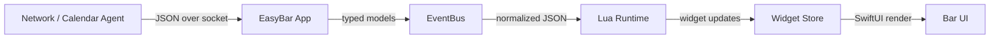

# EasyBar Agents

EasyBar uses two helper processes:

- `easybar-calendar-agent`
- `easybar-network-agent`

Both run out of process, listen on a local Unix socket, and exchange newline-delimited JSON messages with clients.

The main client is EasyBar itself, but the network agent protocol is also reused by standalone clients such as `wifi-snitch`.

## Why agents exist

The agents keep permission-sensitive system APIs out of the main UI process.

EasyBar stays focused on:

- rendering the bar
- managing widgets
- consuming agent data and building UI state

The agents stay focused on:

- permission ownership
- system observation
- raw data collection
- socket delivery

The important boundary is:

- agents collect and return data
- EasyBar decides how that data is rendered

For example, the network agent returns RSSI, while EasyBar maps RSSI into Wi-Fi bars.

## Runtime config

Both agents load the shared runtime config from:

- `EASYBAR_CONFIG_PATH`, when set
- otherwise `~/.config/easybar/config.toml`

Relevant config:

```toml
[logging]
enabled = false
level = "info"
directory = "~/.local/state/easybar"

[agents.calendar]
enabled = true
socket_path = "/tmp/EasyBar/calendar-agent.sock"

[agents.network]
enabled = true
socket_path = "/tmp/EasyBar/network-agent.sock"
refresh_interval_seconds = 60
allow_unauthorized_non_sensitive_fields = false

Supported logging levels are:

* `info`
* `debug`
* `trace`

Environment overrides still exist for:

* config path
* socket paths
* network refresh interval
* agent enablement flags when explicitly supported by the shared runtime config

The app and agents no longer use legacy `EASYBAR_DEBUG` or `EASYBAR_TRACE` toggles for normal runtime logging. Use `logging.level` in `config.toml` instead.

If an agent is disabled in config, the helper app exits immediately without opening its socket.

## Socket paths

Default sockets:

* calendar agent: `/tmp/EasyBar/calendar-agent.sock`
* network agent: `/tmp/EasyBar/network-agent.sock`

EasyBar connects to those sockets directly.

Other local clients can also connect when they speak the same protocol.

## Common protocol shape

Both agents support the same basic command flow:

* `ping`
* `fetch`
* `subscribe`

Both respond with a `kind` field:

* `pong`
* `subscribed`
* `error`

Typical behavior:

* `ping`
  returns one `pong`, then closes
* `fetch`
  returns one data payload, then closes
* `subscribe`
  returns one `subscribed`
  returns one immediate data payload
  keeps the socket open for later pushes

### Transport format

* newline-delimited JSON
* one request per line
* one response per line

Example:

```json
{ "command": "ping" }
```

## How EasyBar uses agent data

EasyBar keeps long-lived subscriptions open to the agents for normal runtime updates.

A manual refresh:

```bash
easybar --refresh
```

- does NOT reload config
- does NOT restart agents
- triggers fresh reads and UI updates

A Lua restart:

```bash
easybar --restart-lua-runtime
```

- restarts only Lua
- does NOT restart agents

A config reload:

```bash
easybar --reload-config
```

- reloads config.toml
- rebuilds runtime state
- recreates agent-backed subscriptions

So the distinction is:

- `refresh`
  refresh runtime state and pull fresh data
- `restart-lua-runtime`
  restart only Lua
- `reload-config`
  rebuild runtime from config

# End-to-end data flow

Understanding how data flows from agents to widgets is critical.

There are three layers:

1. Agent (data collection)
2. EasyBar (mapping + normalization)
3. Lua widgets (consumption + UI)

## Flow overview



## Example: Wi-Fi SSID

### 1. Agent response (flat fields)

```json
{
  "wifi.ssid": "Office WiFi"
}
```

### 2. EasyBar internal mapping

EasyBar converts flat fields into structured data:

```swift
wifi.ssid → event.wifi.ssid
```

### 3. Lua event

```json
{
  "name": "wifi_change",
  "wifi": {
    "ssid": "Office WiFi"
  }
}
```

### 4. Widget usage

```lua
easybar.subscribe("network", easybar.events.wifi_change, function(event)
    local ssid = event.wifi.ssid
end)
```

## Key transformations

| Layer    | Shape                   | Responsibility  |
| -------- | ----------------------- | --------------- |
| Agent    | flat key-value          | data collection |
| EasyBar  | typed models            | normalization   |
| EventBus | structured JSON         | event transport |
| Lua      | structured event object | widget logic    |
| UI       | rendered nodes          | presentation    |

## Important rule

👉 Agents **never care about UI**
👉 Widgets **never care about raw agent format**

EasyBar is the boundary that translates between them.

# Debugging agents

When something does not work, debugging agents is usually the fastest way to find the issue.

## 1. Check processes

```bash
pgrep -fl easybar-calendar-agent
pgrep -fl easybar-network-agent
```

If nothing shows up:

```bash
brew services start gi8lino/tap/easybar-calendar-agent
brew services start gi8lino/tap/easybar-network-agent
```

## 2. Check logs

If logging is enabled:

```toml
[logging]
enabled = true
level = "debug"
```

Logs are written to:

```text
~/.local/state/easybar/
```

Or via Homebrew:

```bash
tail -n 200 ~/Library/Logs/Homebrew/easybar-calendar-agent/*.log
tail -n 200 ~/Library/Logs/Homebrew/easybar-network-agent/*.log
```

For extremely verbose socket and update tracing, temporarily use:

```toml
[logging]
enabled = true
level = "trace"
```

## 3. Test socket manually

You can talk to agents directly.

### Example: ping

```bash
echo '{"command":"ping"}' | nc -U /tmp/EasyBar/network-agent.sock
```

Expected:

```json
{ "kind": "pong" }
```

### Example: fetch fields

```bash
echo '{"command":"fetch","fields":["wifi.ssid"]}' | nc -U /tmp/EasyBar/network-agent.sock
```

## 4. Common problems

### No data returned

- agent not running
- wrong socket path
- config disabled agent

### Wi-Fi fields missing

- Location permission not granted
- check:

```bash
systemsettings Privacy LocationServices
```

### Calendar empty

- Calendar permission not granted
- EventKit access denied

### Permission stuck at `not_determined`

Agents retry with backoff:

```text
1, 2, 3, 5, 8, 13, ... seconds
```

Wait or restart the agent.

### Wrong or stale data

Restart agents:

```bash
brew services restart gi8lino/tap/easybar-network-agent
brew services restart gi8lino/tap/easybar-calendar-agent
```

## 5. Debugging Lua vs Agent

Important distinction:

| Problem                       | Likely source   |
| ----------------------------- | --------------- |
| No socket response            | agent           |
| JSON correct but widget wrong | Lua             |
| Event missing field           | EasyBar mapping |

## 6. Inspect raw agent output

Useful for debugging mapping issues:

```bash
echo '{"command":"fetch","fields":["wifi.ssid","network.primary_interface_is_tunnel"]}' \
  | nc -U /tmp/EasyBar/network-agent.sock
```

Compare:

- raw agent fields
- Lua event (`event.wifi`, `event.network`)

## 7. Debugging strategy

Best order:

1. agent → working?
2. socket → returning data?
3. EasyBar → mapping correctly?
4. Lua → using correct fields?

## Golden rule

👉 Always debug from the bottom up:

```text
Agent → Socket → EasyBar → Lua → UI
```

# Calendar Agent

`easybar-calendar-agent` owns `EventKit`.

It is responsible for:

- requesting calendar access
- observing changes
- building normalized snapshots
- grouping popup sections
- handling event mutations
- pushing updates to subscribers

## Calendar requests

```json
{
  "command": "ping | fetch | subscribe | create_event | update_event | delete_event",
  "query": {
    "startDate": "2026-03-29T00:00:00Z",
    "endDate": "2026-04-01T00:00:00Z"
  }
}
```

Notes:

- `query` required for `fetch` and `subscribe`
- date range is inclusive/exclusive
- filters applied server-side

## Calendar responses

```json
{
  "kind": "snapshot",
  "snapshot": { ... }
}
```

Other kinds:

- `pong`
- `subscribed`
- `created`
- `updated`
- `deleted`
- `error`

## Calendar snapshot

```json
{
  "accessGranted": true,
  "permissionState": "authorized",
  "generatedAt": "2026-03-29T12:34:56Z",
  "events": [],
  "sections": []
}
```

### Event fields

- `id`
- `title`
- `startDate`
- `endDate`
- `isAllDay`
- `calendarName`
- `calendarColorHex`
- `location`
- `isHoliday`
- `hasAlert`
- `travelTimeSeconds`

### Behavior notes

- no access → empty snapshot
- birthdays separated
- travel time handled explicitly
- sections optional

# Network Agent

`easybar-network-agent` owns Wi-Fi and network observation.

It is responsible for:

- location permission handling
- Wi-Fi observation
- primary interface tracking
- RSSI smoothing
- field-based responses

## Key design

Unlike the calendar agent:

👉 the network agent is **field-based**, not snapshot-based

Clients request only what they need.

## Network requests

```json
{
  "command": "fetch",
  "fields": ["wifi.ssid", "network.primary_interface_is_tunnel"]
}
```

## Network responses

```json
{
  "kind": "fields",
  "fields": {
    "wifi.ssid": "Office WiFi",
    "network.primary_interface_is_tunnel": false
  }
}
```

## Field model

The network agent returns a **flat map of typed values**:

```json
{
  "wifi.ssid": "Office WiFi",
  "wifi.rssi": -64,
  "network.primary_interface_is_tunnel": true
}
```

- keys are dot-separated
- values are typed, not stringified UI values

This is different from Lua events, where values are structured into objects.

## Field categories

### Wi-Fi

- `wifi.ssid`
- `wifi.rssi`
- `wifi.noise`
- `wifi.snr`
- `wifi.channel`

### Network

- `network.primary_interface`
- `network.primary_interface_is_tunnel`
- `network.ipv4_address`
- `network.dns_servers`

### Auth

- `auth.location_authorized`
- `auth.location_permission_state`

## Behavior notes

- Wi-Fi fields require location permission
- permission denied → error unless allowed
- RSSI is smoothed
- agent does NOT map UI values

EasyBar converts these into:

- widget state
- Lua event payloads

## Relationship to Lua events

Important distinction:

### Agent response

```json
{
  "wifi.ssid": "Office WiFi"
}
```

### Lua event

```json
{
  "name": "wifi_change",
  "wifi": {
    "ssid": "Office WiFi"
  }
}
```

👉 Agents return flat data
👉 Lua receives structured data

# Services

In the Homebrew setup:

```bash
brew services start gi8lino/tap/easybar-calendar-agent
brew services start gi8lino/tap/easybar-network-agent
```

EasyBar connects to them over Unix sockets.

# Summary

- agents run out-of-process
- JSON over Unix sockets
- calendar = snapshot-based
- network = field-based
- EasyBar maps agent data → structured events → UI

👉 **Agents collect data. EasyBar owns presentation.**
