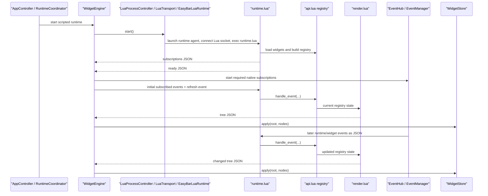

# Lua Runtime

This document explains how EasyBar runs Lua widgets internally.

It is for contributors, not widget authors.
For the public widget API, see [LUA_WIDGETS.md](./LUA_WIDGETS.md).

## Overview

EasyBar does not embed Lua in-process.
It starts a separate Lua process and communicates with it over a dedicated Unix socket, while keeping stderr reserved for logs.

That gives us:

- crash isolation
- simpler reloads
- clean widget state reset on restart
- plain JSON transport between Swift and Lua
- transport isolation from process logs

At a high level:

1. Swift starts the Lua runtime process.
2. Lua loads every widget file from the widget directory.
3. Lua reports which driver events it needs.
4. Swift starts only those event sources.
5. Swift sends normalized events to Lua as JSON lines over the Lua socket.
6. `EasyBarLuaRuntime` connects that socket and then execs Lua, so the Lua runtime still speaks line I/O while Swift owns the socket lifecycle.
7. Lua updates widget state and emits rendered trees as JSON lines over that same socket.
8. Swift decodes those trees and updates the UI store.

## Sequence



## Main pieces

### Swift side

- `LuaProcessController.swift`
  starts and stops the Lua process

- `LuaTransport.swift`
  owns the dedicated Lua socket plus stderr log handling

- `EasyBarLuaRuntime`
  connects the configured Lua socket and then execs the Lua interpreter

- `LuaLogBridge.swift`
  converts structured Lua stderr lines into normal Swift logs

- `LuaRuntime.swift`
  small facade over process + socket transport

- `WidgetEngine.swift`
  owns the runtime handshake, subscriptions, and tree updates

- `EventHub.swift`
  sends app and widget events to both Swift listeners and Lua

- `EventManager.swift`
  starts only the native event sources Lua actually subscribed to

- `RuntimeCoordinator.swift`
  owns startup, shutdown, reload, file watching, and socket-command orchestration

- `WidgetStore.swift`
  stores the latest rendered node trees

### Lua side

- `runtime.lua`
  runtime bootstrap and main loop over socket-backed stdin/stdout

- `loader.lua`
  loads widget files into isolated environments

- `api.lua`
  public `easybar` API, node handles, and registry bridge

- `registry.lua`
  stores node state and applies property normalization

- `subscriptions.lua`
  owns node subscriptions and interval callbacks

- `events.lua`
  normalizes raw payloads and dispatches them

- `render.lua`
  converts registry state into flat node trees

- `json.lua`
  small JSON encoder/decoder

- `log.lua`
  structured stderr logging

## Process lifecycle

### Start

Swift entry:

- `AppController.swift`
  hands off runtime startup to `RuntimeCoordinator.shared.start()`

Runner flow:

- `RuntimeCoordinator.swift`
  starts the widget engine as part of runtime startup

- `WidgetEngine.swift`
  registers for Lua transport lines

- `LuaRuntime.swift`
  starts the launcher, opens the Lua socket listener, and attaches transport

- `LuaProcessController.swift`
  launches the Lua launcher with:
  - configured Lua socket path
  - bundled `runtime.lua`
  - configured widget directory

Important detail:

- Lua runs in its own process group
- shutdown kills the entire group

This prevents orphaned processes.

### Shutdown

Shutdown path:

- `RuntimeCoordinator.stop()`
- `WidgetEngine.shutdown()`
- `EventManager.stopLuaSubscriptions()`
- `LuaRuntime.shutdown()`
- `LuaTransport.shutdown()`
- `LuaProcessController.shutdown()`

This:

- removes observers
- stops handlers
- closes the Lua socket
- terminates the process group

### Reload

Reload is always a full restart:

- stop runtime
- clear state
- start again

This guarantees:

- no stale widget state
- no dangling subscriptions
- deterministic behavior

## Refresh behavior

Three different concepts:

### Normal runtime events

Examples:

- `wifi_change`
- `network_change`
- `minute_tick`
- `mouse.clicked`

### Manual refresh

Triggered via:

```bash
easybar --refresh
```

This:

- keeps current config
- pulls fresh data
- emits refresh events
- does NOT restart Lua

### Lua runtime restart

Triggered via:

```bash
easybar --restart-lua-runtime
```

This:

- fully restarts Lua
- resets all widget state

### Config reload

```bash
easybar --reload-config
```

This:

- reloads config file
- rebuilds runtime state

## Widget loading

Bootstrap begins in `runtime.lua`.

Flow:

1. resolve widget directory
2. load runtime modules
3. call `loader.load_widgets(...)`

Inside `loader.lua`:

1. list `*.lua` files
2. sort deterministically
3. create isolated environment per file
4. inject scoped `easybar` API
5. execute file

Important:

- each widget has isolated defaults
- all widgets share one runtime registry

## Public widget API shape

Lua widget authors use node handles.

`easybar.add(...)` creates one node and returns its handle:

```lua
local clock = easybar.add(easybar.kind.item, "clock", {
    position = "right",
    order = 10,
    label = os.date("%H:%M"),
})
```

The returned handle owns node operations:

- `node.id`
- `node.name`
- `node:set(props)`
- `node:get()`
- `node:remove()`
- `node:subscribe(events, handler)`

Example:

```lua
clock:subscribe(easybar.events.minute_tick, function()
    clock:set({
        label = os.date("%H:%M"),
    })
end)
```

Internally, `api.lua` still delegates to the registry and subscription modules by id. The id-based functions are internal implementation details, not the public widget-author API.

## The widget registry

Defined in `registry.lua`.

Main state:

- `items`
- `item_order`
- `subscriptions`
- `interval_handlers`
- `interval_next_due`
- `pending_async_commands`
- `pending_command_responses`

Internal registry helpers mutate this state:

- add node
- set node props
- get node props
- remove node
- run commands
- store command callbacks

Notable:

- event tokens are used instead of raw strings
- logging levels are exposed to widgets through `easybar.level`
- node handles are the public API wrapper around registry operations

## Event flow

### 1. Swift emits events

From `EventHub.swift`.

Each event:

- notifies Swift listeners
- is sent to Lua as JSON over the dedicated socket

### 2. Lua declares subscriptions

After loading widgets:

- Lua sends required events
- Swift enables only those

The subscription list can change at runtime.

For example, `interval` plus `on_interval` causes Lua to request the shared interval driver cadence it needs.

### 3. Initial events

Once Lua has published both its subscriptions and `ready`, `WidgetEngine` emits the currently subscribed initial event batch and then triggers one normal refresh pass.

This prevents empty UI on startup.

### 4. Manual refresh

Refresh events go through the same pipeline.

No special path.

### 5. Lua dispatch

Lua runtime:

1. read JSON line
2. decode
3. normalize with `events.lua`
4. dispatch through subscriptions
5. render dirty trees

## Render flow

Handled in `render.lua`.

Key design:

- widgets mutate registry state
- renderer builds tree output from registry state

### Steps

1. build nested tree
2. attach popup nodes
3. compute interactions
4. flatten tree
5. emit JSON

### Deduplication

- last output cached by root id
- identical trees are skipped

## Swift tree application

Handled in:

- `WidgetEngine`
- `WidgetStore`

Update logic:

1. remove old nodes for root
2. insert new nodes
3. rebuild index

No diffing needed.

## Logging

Lua logs still go to stderr.
Only the structured runtime protocol moved to the dedicated Lua socket.

Structured format:

```text
EASYBAR_LOG\t<level>\t<context>\tmessage
```

Valid public Lua log levels are:

- `easybar.level.trace`
- `easybar.level.debug`
- `easybar.level.info`
- `easybar.level.warn`
- `easybar.level.error`

These resolve to the lowercase scripting values used by `easybar.log(...)`.

Examples:

```lua
easybar.log(easybar.level.info, "refreshing widget")
easybar.log(easybar.level.debug, "current value", 42)
easybar.log(easybar.level.trace, "raw payload", payload)
```

`LuaLogBridge.swift` is the translation boundary that maps Lua log levels into the Swift host logger.

That means:

- Lua widgets should log using the public Lua API values
- Swift remains the canonical implementation of filtering and output behavior

## End-to-end data flow

This is the complete runtime path from system event to UI:

1. system event occurs, for example Wi-Fi change
2. Swift event source emits through `EventHub`
3. event is forwarded to Lua via socket JSON
4. Lua normalizes and dispatches it
5. widget handlers update registry state through node handles
6. renderer builds a new tree
7. Lua emits JSON tree via the same socket
8. Swift decodes and applies it to `WidgetStore`
9. Swift UI updates accordingly

Important properties:

- no shared memory between Swift and Lua
- all communication is JSON-based
- rendering is always derived, never incremental mutation

## Debugging the runtime

### Check Lua logs

Inspect the normal EasyBar logs and look for messages such as:

```text
lua[widget.lua] ...
lua[runtime] ...
```

For deeper runtime debugging, temporarily raise the host logging level to:

```toml
[logging]
enabled = true
level = "trace"
```

### Run Lua manually

```bash
lua Sources/EasyBar/Lua/runtime.lua <widget_dir>
```

That direct invocation is still useful for Lua-only debugging, but it bypasses the dedicated socket transport used by the app. The full app path is:

- Swift listens on `app.lua_socket_path`
- `EasyBarLuaRuntime` connects that socket
- Lua reads and writes through the attached standard streams

### Verify subscriptions

Look for:

- `subscriptions` message after startup

### Inspect JSON traffic

- Lua socket → events and trees
- stderr → logs

### Common issues

**Widgets not updating**

- missing `node:subscribe(...)`
- event not emitted
- node handle not stored before calling `render()`

**No UI output**

- no `ready` message
- render failure
- widget file failed to load

**Duplicate updates**

- repeated subscriptions
- duplicate widget files
- deduplication issue

**High CPU usage**

- aggressive `interval`
- frequent `second_tick` usage
- expensive shell commands in sync `easybar.exec(...)`

## Where to change what

### Widget API

- `api.lua`
- `easybar_api.base.lua`
- `easybar_api.events.lua`
- `easybar_api.lua`
- `LUA_WIDGETS.md`

`easybar_api.base.lua` is the hand-edited source stub.
`easybar_api.events.lua` is generated from the event catalog.
`easybar_api.lua` is the combined generated artifact that EasyBar installs for LuaLS/editor support.

### Driver events

- `event_tokens.lua`
- `easybar_api.events.lua`
- `easybar_api.lua`
- Swift event sources

### Event payloads

- `EventHub.swift`
- `EventTypes.swift`
- `events.lua`

### Rendering

- `render.lua`
- `WidgetNodeState.swift`

### Process/runtime

- `RuntimeCoordinator.swift`
- `WidgetEngine.swift`
- `LuaProcessController.swift`
- `LuaTransport.swift`

## Contributor notes

- widget directory is executable Lua
- every `*.lua` file is loaded
- reload = full reset
- protocol:
  - Lua socket JSON in/out via `EasyBarLuaRuntime`
  - stderr logs

If you change the Lua API:

- update runtime
- update stubs
- update docs
- update examples
