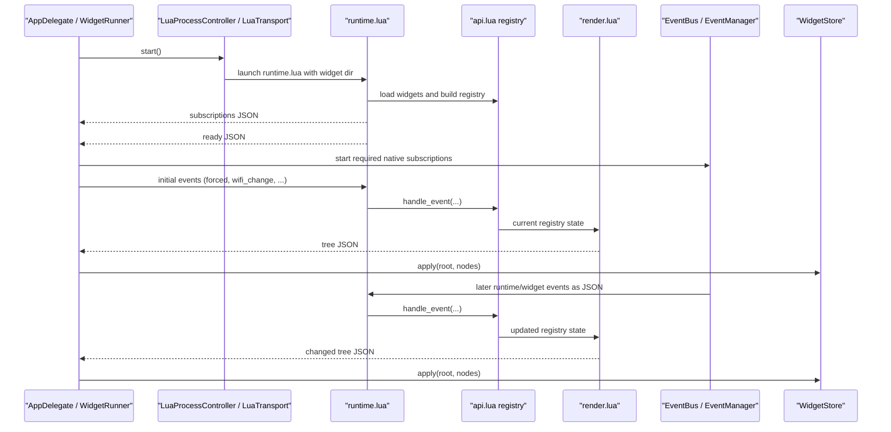

# Lua Runtime

This document explains how EasyBar runs Lua widgets internally.

It is for contributors, not widget authors.
For the public widget API, see [LUA_WIDGETS.md](./LUA_WIDGETS.md).

## Overview

EasyBar does not embed Lua in-process.
It starts a separate Lua process and communicates with it over stdin/stdout/stderr.

That gives us:

- crash isolation
- simpler reloads
- clean widget state reset on restart
- plain JSON transport between Swift and Lua

At a high level:

1. Swift starts the Lua runtime process.
2. Lua loads every widget file from the widget directory.
3. Lua reports which driver events it needs.
4. Swift starts only those event sources.
5. Swift sends normalized events to Lua as JSON lines.
6. Lua updates widget state and emits rendered trees as JSON lines.
7. Swift decodes those trees and updates the UI store.

## Sequence



## Main pieces

### Swift side

- `LuaProcessController.swift`
  starts and stops the Lua process

- `LuaTransport.swift`
  owns stdin/stdout/stderr pipes

- `LuaLogBridge.swift`
  converts structured Lua stderr lines into normal Swift logs

- `LuaRuntime.swift`
  small facade over process + transport

- `WidgetRunner.swift`
  owns the runtime handshake, subscriptions, and tree updates

- `EventBus.swift`
  sends app and widget events to both Swift listeners and Lua

- `EventManager.swift`
  starts only the native event sources Lua actually subscribed to

- `WidgetStore.swift`
  stores the latest rendered node trees

### Lua side

- `runtime.lua`
  runtime bootstrap and main loop

- `loader.lua`
  loads widget files into isolated environments

- `api.lua`
  widget registry and public `easybar` API

- `events.lua`
  normalizes raw payloads and dispatches them

- `render.lua`
  converts registry state into flat node trees

- `json.lua`
  small JSON encoder/decoder

- `log.lua`
  structured stderr logging

## Process lifecycle

### Start

Swift entry:

- `AppDelegate.swift`
  calls `WidgetRunner.shared.start()`

Runner flow:

- `WidgetRunner.swift`
  registers for Lua stdout notifications

- `LuaRuntime.swift`
  starts the process and attaches transport

- `LuaProcessController.swift`
  launches Lua with:
  - bundled `runtime.lua`
  - configured widget directory

Important detail:

- Lua runs in its own process group
- shutdown kills the entire group

This prevents orphaned processes.

### Shutdown

Shutdown path:

- `WidgetRunner.shutdown()`
- `LuaRuntime.shutdown()`
- `LuaTransport.shutdown()`
- `LuaProcessController.shutdown()`

This:

- removes observers
- stops handlers
- closes pipes
- terminates the process group

### Reload

Reload is always a full restart:

- stop runtime
- clear state
- start again

This guarantees:

- no stale widget state
- no dangling subscriptions
- deterministic behavior

## Refresh behavior

Three different concepts:

### Normal runtime events

Examples:

- `wifi_change`
- `network_change`
- `minute_tick`
- `mouse.clicked`

### Manual refresh

Triggered via:

```bash
easybar --refresh
```

This:

- keeps current config
- pulls fresh data
- emits refresh events
- does NOT restart Lua

### Lua runtime restart

Triggered via:

```bash
easybar --restart-lua-runtime
```

This:

- fully restarts Lua
- resets all widget state

### Config reload

```bash
easybar --reload-config
```

This:

- reloads config file
- rebuilds runtime state

## Widget loading

Bootstrap begins in `runtime.lua`.

Flow:

1. resolve widget directory
2. load runtime modules
3. call `loader.load_widgets(...)`

Inside `loader.lua`:

1. list `*.lua` files
2. sort deterministically
3. create isolated environment per file
4. inject scoped `easybar` API
5. execute file

Important:

- each widget has isolated defaults
- all share one registry

## The widget registry

Defined in `api.lua`.

Main state:

- `items`
- `item_order`
- `subscriptions`
- `routine_next_due`
- `needs_second_tick`

API methods mutate this registry:

- `add`
- `set`
- `get`
- `remove`
- `exec`
- `subscribe`
- `log`
- `events`

Notable:

- event tokens are used instead of raw strings

## Event flow

### 1. Swift emits events

From `EventBus.swift`.

Each event:

- notifies Swift listeners
- is sent to Lua as JSON

### 2. Lua declares subscriptions

After loading widgets:

- Lua sends required events
- Swift enables only those

### 3. Initial events

After `ready`, Swift emits:

- `forced`
- `wifi_change`
- `network_change`
- `minute_tick`
- `second_tick`

This prevents empty UI on startup.

### 4. Manual refresh

Refresh events go through the same pipeline.

No special path.

### 5. Lua dispatch

Lua runtime:

1. read JSON line
2. decode
3. normalize (`events.lua`)
4. dispatch
5. render

## Render flow

Handled in `render.lua`.

Key design:

- widgets mutate state
- renderer builds tree

### Steps

1. build nested tree
2. attach popup nodes
3. compute interactions
4. flatten tree
5. emit JSON

### Deduplication

- last output cached
- identical trees are skipped

## Swift tree application

Handled in:

- `WidgetRunner`
- `WidgetStore`

Update logic:

1. remove old nodes for root
2. insert new nodes
3. rebuild index

No diffing needed.

## Logging

Lua logs to stderr.

Structured format:

```text
EASYBAR_LOG\t<level>\t<context>\tmessage
```

Valid Lua log levels are:

- `trace`
- `debug`
- `info`
- `warn`
- `error`

The Lua side treats those strings as the public scripting contract.
`LuaLogBridge.swift` is the translation boundary that maps them into the Swift host logger.

That means:

- Lua widgets should log using the lowercase public API values
- Lua runtime internals may emit uppercase structured lines on stderr
- Swift remains the canonical implementation of filtering and output behavior

## End-to-end data flow

This is the complete runtime path from system event to UI:

1. system event occurs, for example Wi-Fi change
2. Swift event source emits through `EventBus`
3. event is forwarded to Lua via stdin JSON
4. Lua normalizes and dispatches it
5. widget handlers update registry state
6. renderer builds a new tree
7. Lua emits JSON tree via stdout
8. Swift decodes and applies it to `WidgetStore`
9. Swift UI updates accordingly

Important properties:

- no shared memory between Swift and Lua
- all communication is JSON-based
- rendering is always derived, never incremental mutation

## Debugging the runtime

### Check Lua logs

Inspect the normal EasyBar logs and look for messages such as:

```text
lua[widget.lua] ...
lua[runtime] ...
```

For deeper runtime debugging, temporarily raise the host logging level to:

```toml
[logging]
enabled = true
level = "trace"
```

### Run Lua manually

```bash
lua runtime.lua <widget_dir>
```

### Verify subscriptions

Look for:

- `subscriptions` message after startup

### Inspect JSON traffic

- stdin → events
- stdout → trees
- stderr → logs

### Common issues

**Widgets not updating**

- missing `subscribe`
- event not emitted

**No UI output**

- no `ready` message
- render failure

**Duplicate updates**

- deduplication issue

**High CPU usage**

- aggressive `update_freq`

## Where to change what

### Widget API

- `api.lua`
- `easybar_api.lua`
- `LUA_WIDGETS.md`

### Driver events

- `api.lua`
- `easybar_api.lua`
- Swift event sources

### Event payloads

- `EventBus.swift`
- `events.lua`

### Rendering

- `render.lua`
- `WidgetNodeState.swift`

### Process/runtime

- `LuaProcessController.swift`
- `LuaTransport.swift`
- `WidgetRunner.swift`

## Contributor notes

- widget directory is executable Lua
- every `*.lua` file is loaded
- reload = full reset
- protocol:
  - stdin JSON in
  - stdout JSON out
  - stderr logs

If you change the Lua API:

- update runtime
- update stub
- update docs
- update examples
