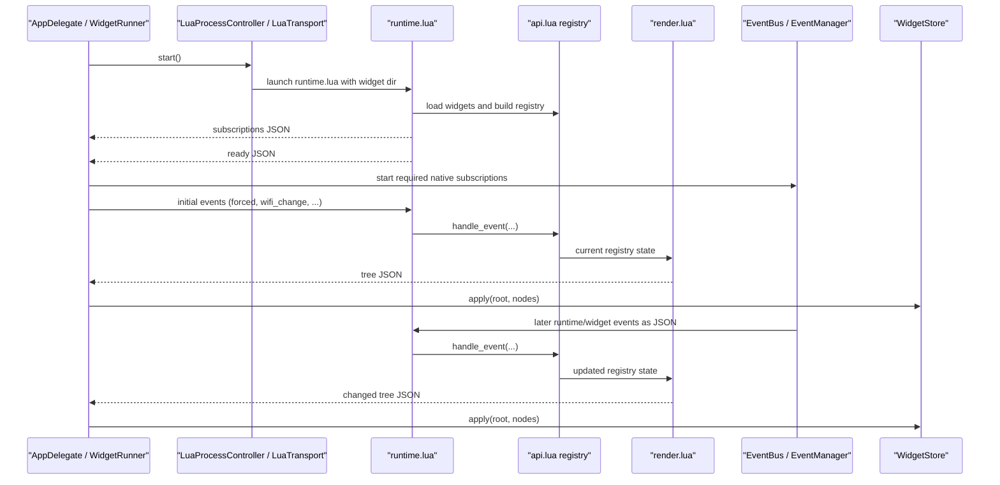

# Lua Runtime

This document explains how EasyBar runs Lua widgets internally.

It is for contributors, not widget authors.
For the public widget API, see [LUA_WIDGETS.md](./docs/LUA_WIDGETS.md).

## Overview

EasyBar does not embed Lua in-process.
It starts a separate Lua process and communicates with it over stdin/stdout/stderr.

That gives us:

- crash isolation
- simpler reloads
- clean widget state reset on restart
- plain JSON transport between Swift and Lua

At a high level:

1. Swift starts the Lua runtime process.
2. Lua loads every widget file from the widget directory.
3. Lua reports which driver events it needs.
4. Swift starts only those event sources.
5. Swift sends normalized events to Lua as JSON lines.
6. Lua updates widget state and emits rendered trees as JSON lines.
7. Swift decodes those trees and updates the UI store.

## Sequence



## Main pieces

### Swift side

- [LuaProcessController.swift](./Sources/EasyBar/Widgets/Runtime/LuaProcessController.swift)
  starts and stops the Lua process
- [LuaTransport.swift](./Sources/EasyBar/Widgets/Runtime/LuaTransport.swift)
  owns stdin/stdout/stderr pipes
- [LuaLogBridge.swift](./Sources/EasyBar/Widgets/Runtime/LuaLogBridge.swift)
  converts structured Lua stderr lines into normal Swift logs
- [LuaRuntime.swift](./Sources/EasyBar/Widgets/Runtime/LuaRuntime.swift)
  small facade over process + transport
- [WidgetRunner.swift](./Sources/EasyBar/Widgets/Runtime/WidgetRunner.swift)
  owns the runtime handshake, subscriptions, and tree updates
- [EventBus.swift](./Sources/EasyBar/Events/EventBus.swift)
  sends app and widget events to both Swift listeners and Lua
- [EventManager.swift](./Sources/EasyBar/Events/EventManager.swift)
  starts only the native event sources Lua actually subscribed to
- [WidgetStore.swift](./Sources/EasyBar/Widgets/State/WidgetStore.swift)
  stores the latest rendered node trees

### Lua side

- [runtime.lua](./Sources/EasyBar/Lua/runtime.lua)
  runtime bootstrap and main loop
- [loader.lua](./Sources/EasyBar/Lua/easybar/loader.lua)
  loads widget files into isolated environments
- [api.lua](./Sources/EasyBar/Lua/easybar/api.lua)
  widget registry and public `easybar` API
- [events.lua](./Sources/EasyBar/Lua/easybar/events.lua)
  normalizes raw payloads and dispatches them
- [render.lua](./Sources/EasyBar/Lua/easybar/render.lua)
  converts registry state into flat node trees
- [json.lua](./Sources/EasyBar/Lua/easybar/json.lua)
  small JSON encoder/decoder
- [log.lua](./Sources/EasyBar/Lua/easybar/log.lua)
  structured stderr logging

## Process lifecycle

### Start

Swift entry:

- [AppDelegate.swift](./Sources/EasyBar/App/AppDelegate.swift)
  calls `WidgetRunner.shared.start()`

Runner flow:

- [WidgetRunner.swift](./Sources/EasyBar/Widgets/Runtime/WidgetRunner.swift)
  registers for Lua stdout notifications
- [LuaRuntime.swift](./Sources/EasyBar/Widgets/Runtime/LuaRuntime.swift)
  starts the process and attaches transport
- [LuaProcessController.swift](./Sources/EasyBar/Widgets/Runtime/LuaProcessController.swift)
  launches the configured Lua binary with:
  - bundled `runtime.lua`
  - configured widget directory path

Important detail:

- the Lua process is put in its own process group
- shutdown kills the whole group, not only the parent process

That prevents orphaned shell commands or child processes from surviving reloads.

### Shutdown

Shutdown path:

- `WidgetRunner.shutdown()`
- `LuaRuntime.shutdown()`
- `LuaTransport.shutdown()`
- `LuaProcessController.shutdown()`

This:

- removes stdout observers
- stops readability handlers
- closes pipes
- terminates the Lua process group

### Reload

Reload path is intentionally simple:

- stop runtime
- clear rendered widget state
- start runtime again

That means Lua widget reload is a full state reset, not an in-place hot patch.

This is why reload behavior is predictable:

- no partial widget state reuse
- no old subscriptions left behind
- no stale popup trees left in the store

## Refresh behavior

It is useful to distinguish three different things:

- normal runtime events
- a manual refresh
- a Lua runtime reload

A normal event is something like `wifi_change`, `network_change`, `minute_tick`, or `mouse.clicked`.

A manual refresh is triggered by EasyBar itself, for example through:

```bash
easybar --refresh
```

That refresh:

- uses the currently loaded config
- pulls fresh state through the already running app and agent clients
- emits refresh-style events so Lua widgets and native widgets can update immediately
- does not reread `config.toml` from disk
- does not restart the Lua process

A Lua runtime reload is different.
That fully shuts the Lua side down and starts it again, which resets widget runtime state.

So the intended distinction is:

- `refresh`
  refresh current runtime state
- `reload-config`
  reload config and rebuild runtime state
- Lua runtime restart
  restart the Lua process itself

## Widget loading

Lua bootstrap starts in [runtime.lua](./Sources/EasyBar/Lua/runtime.lua).

It loads the bundled runtime modules, resolves the widget directory, creates the registry, and then calls:

- `loader.load_widgets(widget_dir, registry, log)`

Inside [loader.lua](./Sources/EasyBar/Lua/easybar/loader.lua):

1. list every `*.lua` file in the widget directory
2. sort them
3. create one isolated environment per file
4. inject one widget-scoped `easybar` API into that environment
5. `loadfile(...)` and execute the widget

Important property:

- each widget file gets its own scoped defaults via `easybar.default(...)`
- but all widget files share one registry underneath

So widget-local defaults do not leak across files, but the final rendered tree is global.

## The widget registry

The registry lives in [api.lua](./Sources/EasyBar/Lua/easybar/api.lua).

The main state is:

- `items`
  item definitions keyed by id
- `item_order`
  stable creation order
- `subscriptions`
  event handlers keyed by widget id and event name
- `routine_next_due`
  next execution times for `update_freq`
- `needs_second_tick`
  whether the runtime needs the second timer for polling

The public widget API methods all update that registry:

- `add`
- `set`
- `animate`
- `get`
- `remove`
- `exec`
- `subscribe`
- `log`
- `events`

Notable behavior:

- `animate(...)` is currently just a semantic wrapper over `set(...)`
- `subscribe(...)` now accepts `easybar.events...` tokens, not raw strings
- widget APIs are scoped wrappers over one shared registry

## Event flow

### 1. Swift emits an event

Native sources eventually emit through [EventBus.swift](./Sources/EasyBar/Events/EventBus.swift).

Examples:

- system wake
- sleep
- Wi-Fi change
- network change
- volume change
- widget mouse events
- slider events
- manual refresh

`EventBus` does two things with each payload:

1. posts a native notification for Swift-side listeners
2. encodes the payload as JSON and sends it to Lua stdin

### 2. Lua advertises required events

After loading widgets, Lua emits a `subscriptions` message with the driver events it needs.

That list comes from:

- `registry.required_events()`

This is important because EasyBar does not start every event source by default.

Swift receives that list in [WidgetRunner.swift](./Sources/EasyBar/Widgets/Runtime/WidgetRunner.swift) and passes it to:

- [EventManager.swift](./Sources/EasyBar/Events/EventManager.swift)

`EventManager` then subscribes only to the required native event producers.

That keeps idle work down.

### 3. Initial events

Once Lua has:

- sent subscriptions
- and sent `ready`

Swift emits a small initial refresh burst in `WidgetRunner.emitInitialEvents()`.

This ensures widgets do not wait for the next real-world change before showing useful state.

Examples:

- `system_woke`
- `wifi_change`
- `network_change`
- `minute_tick`
- `second_tick`
- `forced`

### 4. Manual refresh

When EasyBar receives a manual refresh request, it can emit refresh-related events into the same event pipeline.

That means Lua widgets participate in refreshes through the same normalized event boundary they already use for normal runtime updates.

This is one reason refresh is not the same thing as restarting the Lua runtime:
the event pipeline stays alive and the existing widget process keeps running.

### 5. Lua normalizes and dispatches

Lua receives one stdin line at a time in [runtime.lua](./Sources/EasyBar/Lua/runtime.lua).

Flow:

1. decode JSON
2. normalize the payload in [events.lua](./Sources/EasyBar/Lua/easybar/events.lua)
3. dispatch it into the registry
4. re-render all root trees

Normalized event fields include:

- `name`
- `widget_id`
- `target_widget_id`
- `button`
- `direction`
- `value`
- `delta_x`
- `delta_y`

Widget handlers only ever see normalized events, not raw JSON.

## Render flow

Rendering is handled in [render.lua](./Sources/EasyBar/Lua/easybar/render.lua).

Important design point:

- widgets do not return trees directly
- widgets mutate registry state
- the renderer derives trees from that state

### Build steps

For each root id:

1. build the nested tree
2. resolve popup children separately from regular children
3. derive node interaction capabilities from subscriptions
4. flatten the nested tree into a flat node list
5. encode and emit JSON

### Flat tree payload

The Swift side receives payloads like:

- `type = "tree"`
- `root = "<root_id>"`
- `nodes = [...]`

Each node includes:

- identity
- position
- parent linkage
- style values
- interaction flags
- popup role markers

### Deduplication

`render.lua` caches the last emitted JSON per root in `last_emitted`.

If a newly rendered tree encodes to the same JSON string:

- it is skipped
- no redundant UI update is emitted

This is the main Lua-side render dedup step.

## Swift tree application

Lua tree output is decoded by [WidgetRunner.swift](./Sources/EasyBar/Widgets/Runtime/WidgetRunner.swift) into:

- [WidgetTreeUpdate.swift](./Sources/EasyBar/Widgets/State/WidgetTreeUpdate.swift)

Tree updates are then applied to:

- [WidgetStore.swift](./Sources/EasyBar/Widgets/State/WidgetStore.swift)

`WidgetStore` keeps:

- a node map keyed by id
- a root index keyed by root id

When one root updates:

1. existing ids for that root are removed
2. new nodes are stored
3. the published node list is rebuilt and sorted

That root-scoped replacement is why Lua widgets can re-render one root cleanly without manually diffing children in Lua.

## Logging

Lua writes logs to stderr.

Structured lines use this prefix:

- `EASYBAR_LOG\t`

That format is consumed by:

- [LuaLogBridge.swift](./Sources/EasyBar/Widgets/Runtime/LuaLogBridge.swift)

The bridge maps Lua log levels into the normal Swift logger and prefixes messages like:

- `lua[runtime] ...`
- `lua[wireguard.lua] ...`

If a Lua stderr line does not follow the structured format, it is logged as raw stderr.

## Where to change what

### Add or change widget API behavior

Start in:

- [api.lua](./Sources/EasyBar/Lua/easybar/api.lua)
- [easybar_api.lua](./Sources/EasyBar/Lua/easybar_api.lua)
- [LUA_WIDGETS.md](./docs/LUA_WIDGETS.md)

Update all three together:

- runtime implementation
- shipped editor stub
- public docs

### Add a new driver event

Touch:

- `DRIVER_EVENTS` in [api.lua](./Sources/EasyBar/Lua/easybar/api.lua)
- `easybar.events` in [easybar_api.lua](./Sources/EasyBar/Lua/easybar_api.lua)
- the Swift event source in:
  - [EventManager.swift](./Sources/EasyBar/Events/EventManager.swift)
  - and the relevant emitter/service

### Add a new event payload field

Touch:

- [EventBus.swift](./Sources/EasyBar/Events/EventBus.swift)
- [events.lua](./Sources/EasyBar/Lua/easybar/events.lua)
- the editor stub if widget authors should see it

### Change visual rendering

Touch:

- [render.lua](./Sources/EasyBar/Lua/easybar/render.lua)
- [WidgetNodeState.swift](./Sources/EasyBar/Widgets/State/WidgetNodeState.swift)
- relevant Swift views

### Change process lifecycle or transport

Touch:

- [LuaProcessController.swift](./Sources/EasyBar/Widgets/Runtime/LuaProcessController.swift)
- [LuaTransport.swift](./Sources/EasyBar/Widgets/Runtime/LuaTransport.swift)
- [WidgetRunner.swift](./Sources/EasyBar/Widgets/Runtime/WidgetRunner.swift)

## Contributor notes

- The widget directory is treated as executable Lua, not a static data directory.
- Every `*.lua` file there is loaded.
- Reload is full runtime replacement, not incremental patching.
- Keep the runtime protocol simple:
  - stdin JSON in
  - stdout JSON out
  - stderr logs

- If you change the public Lua API, also update:
  - the shipped stub
  - the widget docs
  - bundled example widgets
