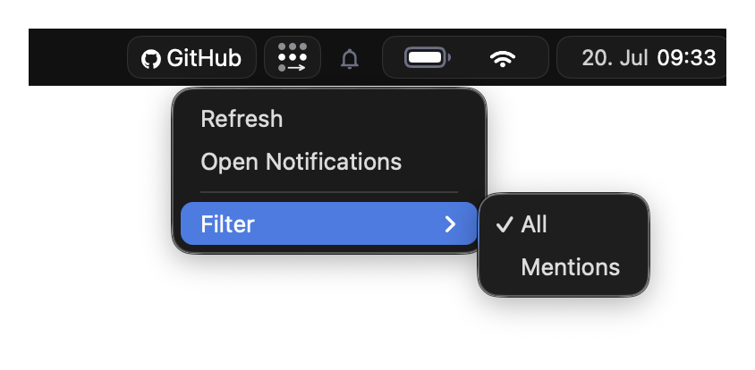

# EasyBar

EasyBar is a lightweight, scriptable macOS status bar built with SwiftUI and Lua.

Use native built-ins for common system data such as spaces, battery, Wi-Fi, calendar, time, date, and volume. Add Lua widgets only when you need custom display logic, shell-command integration, or personal workflow behavior.

EasyBar is designed for a clean macOS workflow and integrates especially well with AeroSpace. EasyBar requires AeroSpace 0.21.0 or newer for AeroSpace-backed widgets.

## Start here

New users should follow the user path first:

1. [Quick Start](getting-started/quick-start.md): install EasyBar, start the services, verify that the bar responds, and optionally create a custom config.
2. [Built-ins Vs Lua](getting-started/builtins-vs-lua.md): choose whether a widget belongs in `config.toml` or in a Lua file.
3. [Configuration Overview](configuration/overview.md): learn where config lives and which pages explain each config area.
4. [Lua Widgets](lua/overview.md): add custom widgets after the built-ins cover the basics.
5. [Troubleshooting](runtime/troubleshooting.md): fix startup, service, config, permission, and runtime issues.

If you are changing EasyBar itself, start with [Internals](internals/overview.md) instead. Contributor and architecture notes are intentionally kept out of the first-run path.

## Common tasks

| Goal                            | Start with                                           |
| ------------------------------- | ---------------------------------------------------- |
| Install and see the bar         | [Quick Start](getting-started/quick-start.md)        |
| Find the runtime config path    | [Config Path](getting-started/configuration-path.md) |
| Enable native widgets           | [Built-ins](configuration/builtins.md)               |
| See all command-line controls   | [CLI Reference](runtime/cli.md)                      |
| Group built-in widgets visually | [Native Groups](configuration/native-groups.md)      |
| Pick or customize colors        | [Themes](configuration/themes.md)                    |
| Add a custom widget             | [First Widget](lua/guides/first-widget.md)           |
| Browse bundled widget examples  | [Bundled Widgets](lua/guides/bundled-widgets.md)     |
| Debug a stuck bar               | [Troubleshooting](runtime/troubleshooting.md)        |
| Understand process boundaries   | [Internals](internals/overview.md)                   |

## Features

- Native macOS bar window built with SwiftUI
- Configurable native widgets for spaces, applications, system status, calendar, and more
- Object-style Lua widgets with events, timers, asynchronous commands, popups, and groups
- Native right-click context menus for Lua widgets
- Shared native inbox with unread state, grouping, persistence, Markdown, and publisher actions
- File-based themes with bundled and custom TOML palettes
- AeroSpace integration for spaces, focused app state, and layout mode state
- Calendar and network helper agents for permission-sensitive data
- Persistent menu bar controller and CLI commands for reloads, restarts, and diagnostics
- Homebrew cask installation into `/Applications` with separate permission-agent services
- Config-driven logging, troubleshooting diagnostics, and lightweight runtime metrics

## How EasyBar is meant to be used

Start with the native built-ins because they keep platform-sensitive behavior in Swift and require less maintenance. Use `config.toml` for placement, grouping, themes, and built-in behavior. Reach for Lua when a widget needs custom formatting, shell commands, custom interactions, or project-specific status.

For architecture, process boundaries, agent protocols, Lua runtime internals, and contributor notes, use [Internals](internals/overview.md).

## Screenshots

### Calendar

[{ .screenshot-compact }](assets/month.png)

### Upcoming

[{ .screenshot-compact }](assets/upcoming.png)

## Inbox

### CPU

### Wi-Fi

### Front app

### Custom context menu

