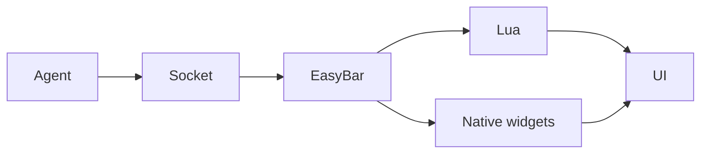

# Debugging Agents

When something does not work, debugging agents is usually the fastest way to find the issue. This is the canonical page for helper-agent process checks, socket probes, raw field inspection, and agent logs.

## 1. Check processes

```bash
pgrep -fl EasyBarCalendarAgent
pgrep -fl EasyBarNetworkAgent
```

If nothing shows up:

```bash
open -a EasyBar
```

## 2. Check logs

If logging is enabled:

```toml
[logging]
enabled = true
level = "debug"
```

Logs are written to:

```text
~/.local/state/easybar/
```

For extremely verbose socket and update tracing, temporarily use:

```toml
[logging]
enabled = true
level = "trace"
```

## 3. Test socket manually

You can talk to agents directly.

Ping the network agent:

```bash
echo '{"command":"ping"}' | nc -U ~/.local/state/easybar/runtime/network-agent.sock
```

Expected response:

```json
{ "kind": "pong" }
```

Fetch one Wi-Fi field:

```bash
echo '{"command":"fetch","fields":["wifi.ssid"]}' | nc -U ~/.local/state/easybar/runtime/network-agent.sock
```

Fetch Wi-Fi details and primary IP addresses:

```bash
echo '{"command":"fetch","fields":["wifi.ssid","network.ipv4_address","network.ipv6_address","wifi.rssi","wifi.link_quality"]}' \
  | nc -U ~/.local/state/easybar/runtime/network-agent.sock
```

Fetch all Wi-Fi fields:

```bash
echo '{"command":"fetch","fields":["wifi.*"]}' | nc -U ~/.local/state/easybar/runtime/network-agent.sock
```

Fetch all network fields:

```bash
echo '{"command":"fetch","fields":["network.*"]}' | nc -U ~/.local/state/easybar/runtime/network-agent.sock
```

## 4. Common problems

### No data returned

Likely causes:

- agent not running
- wrong socket path
- config disabled agent
- socket request is malformed
- requested fields are unknown

Check config:

```toml
[agents.network]
enabled = true
socket_path = "~/.local/state/easybar/runtime/network-agent.sock"
```

Restart the agent:

```bash
easybar --restart-network-agent
```

### Wi-Fi fields missing

Likely causes:

- Location Services permission not granted
- EasyBar or the network agent was not restarted after a permission change
- Wi-Fi is disabled
- no active Wi-Fi interface exists

Open macOS Location Services settings:

```bash
systemsettings Privacy LocationServices
```

Then restart:

```bash
easybar --restart-network-agent
```

### IPv4 or IPv6 missing in the Wi-Fi widget

The built-in Wi-Fi widget renders IPv4 and IPv6 from the network-agent fields:

- `network.ipv4_address`
- `network.ipv6_address`

Check the raw agent output first:

```bash
echo '{"command":"fetch","fields":["network.ipv4_address","network.ipv6_address"]}' \
  | nc -U ~/.local/state/easybar/runtime/network-agent.sock
```

If the raw fields are missing, the issue is in the network agent or system network state.

If the raw fields are present but the widget does not show them, check your config:

```toml
[builtins.wifi.content]
mode = "details"

[builtins.wifi.fields]
ipv4_address = true
ipv6_address = true
```

Then reload config:

```bash
easybar --reload-config
```

### Wi-Fi details are stale

Try a normal refresh:

```bash
easybar --refresh
```

If that does not help, restart the network agent and EasyBar:

```bash
easybar --restart-network-agent
```

### Calendar empty

Likely causes:

- Calendar permission not granted
- EventKit access denied
- calendar agent is not running
- filters exclude the visible calendars

Restart the calendar agent after changing permission settings:

```bash
easybar --restart-calendar-agent
```

### Calendar request permanently rejected

A log such as:

```text
month calendar agent client request permanently rejected code=invalid_request
```

means the socket connection succeeded, but the calendar agent rejected the subscription payload.
Calendar fetch and subscription ranges may span at most 366 days. EasyBar derives its normal month
preload from that shared limit, so this message usually indicates an incompatible client, malformed
manual request, or a regression in request construction.

`invalid_request` is permanent for the exact request. EasyBar logs it once, stops reconnecting with
the same payload, and keeps the last valid calendar snapshot visible. A changed request or socket
configuration resumes the connection. Reload configuration after correcting the request:

```bash
easybar --reload-config
```

Do not interpret this message as a missing socket or stopped agent. A repeated `connected` /
`reconnect scheduled` loop for the same `invalid_request` indicates incorrect client behavior.

### Permission stuck at `not_determined`

Agents retry with backoff:

```text
1, 2, 3, 5, 8, 13, ... seconds
```

Wait or restart the agent.

### Wrong or stale data

Restart agents:

```bash
easybar --restart-agents
```

## Debugging Lua vs Agent

| Problem                                                 | Likely source                |
| ------------------------------------------------------- | ---------------------------- |
| No socket response                                      | agent                        |
| JSON correct but widget wrong                           | Lua or native widget mapping |
| Event missing field                                     | EasyBar mapping              |
| Field missing from raw socket response                  | agent                        |
| Field present in raw socket response but absent from UI | widget config or renderer    |

## Inspect raw agent output

Useful for debugging mapping issues:

```bash
echo '{"command":"fetch","fields":["wifi.ssid","network.primary_interface_is_tunnel","network.ipv4_address","network.ipv6_address"]}' \
  | nc -U ~/.local/state/easybar/runtime/network-agent.sock
```

Compare:

- raw agent fields
- native widget config
- Lua event tables such as `event.network`
- rendered UI state

## Debugging strategy

Best order:

1. agent: working?
2. socket: returning data?
3. EasyBar: mapping correctly?
4. config: fields enabled?
5. Lua or native renderer: using the correct fields?

Always debug from the bottom up:


