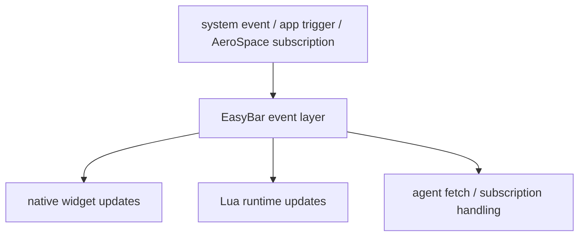

# Event Flow

EasyBar reacts to several kinds of events:

- macOS state changes
- AeroSpace-related changes
- agent socket updates
- Lua runtime subscriptions
- direct control-socket commands
- user interaction such as clicks, hover, scroll, and sliders

## Simplified flow

The important design choice is that EasyBar acts as the coordinator.

It does not let every subsystem talk to every other subsystem directly.

## Delivery backpressure

Automatic native subscriptions keep at most 256 must-deliver events. If a subscriber does not consume them before another action arrives, EasyBar records the dropped event, finishes that stalled stream, and removes the subscriber instead of silently losing an action while continuing with corrupted state. Coalescing-only subscriptions keep only their newest state value.

Lua delivery separately retains at most 512 queued must-deliver payloads plus a bounded coalescing queue. Reaching the action limit records `luaEventQueueOverflows`, suspends delivery for that runtime session, and restarts Lua through normal supervision. The next runtime session explicitly resets the sink. Current queue depth is exposed as `luaEventQueueDepth`.

## Lua runtime flow

The Lua runtime flow is:

1. EasyBar starts the Lua process.
2. Lua loads widget files from the widget directory.
3. Lua declares which events it needs.
4. Swift starts only the necessary event sources.
5. Swift sends normalized events to Lua.
6. Lua updates widget state and emits rendered trees.
7. Swift decodes those trees and applies them to the widget store.

This design intentionally avoids embedding arbitrary Lua execution into the UI process.

