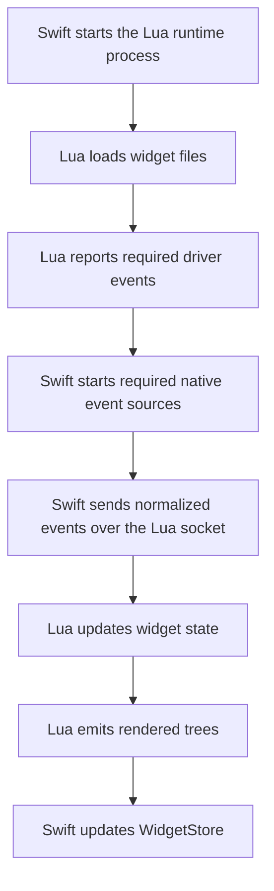
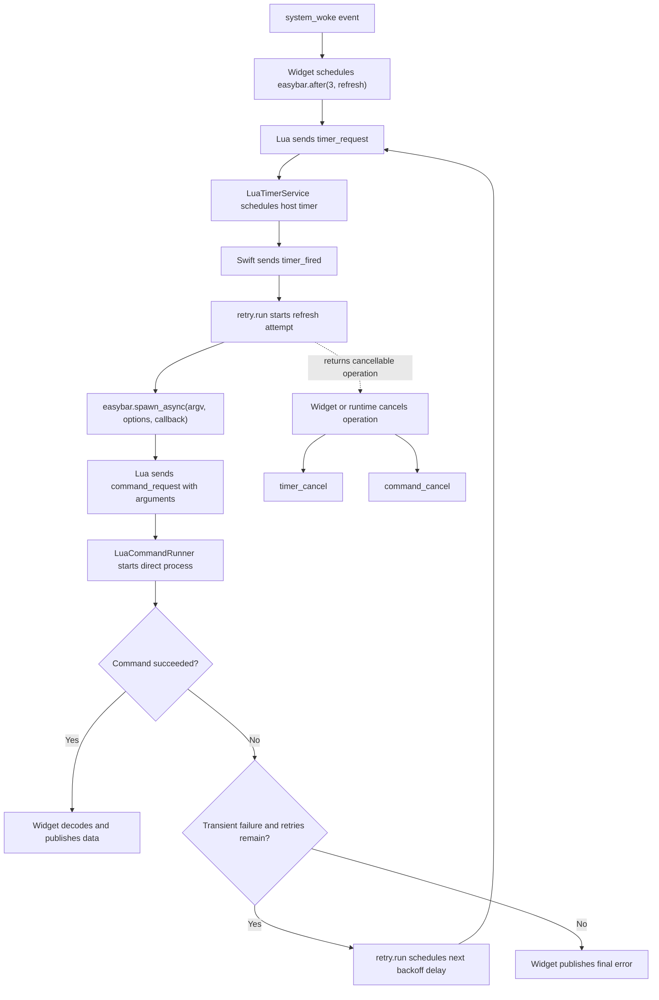

# Lua Runtime Overview

This section explains how EasyBar runs Lua widgets internally.

It is for contributors. For the public widget API, see [Lua Widgets](../../lua/overview.md).

## Overview

EasyBar does not embed Lua in-process.

It starts a separate Lua process and communicates with it over a dedicated Unix socket, while keeping stderr reserved for logs.

That gives the project:

- crash isolation
- simpler reloads
- clean widget state reset on restart
- plain JSON transport between Swift and Lua
- transport isolation from process logs

## High-level flow



1. Swift starts the Lua runtime process.
2. Lua loads every widget file from the widget directory.
3. Lua reports which driver events it needs.
4. Swift starts only those event sources.
5. Swift sends normalized events to Lua as JSON lines over the Lua socket.
6. `EasyBarLuaRuntime` connects that socket and then execs Lua, so the Lua runtime still speaks line I/O while Swift owns the socket lifecycle.
7. Lua updates widget state and emits rendered trees as JSON lines over that same socket.
8. Swift decodes those trees and updates the UI store.

## Main Swift pieces

- `LuaProcessController.swift`
  starts and stops the Lua process
- `LuaTransport.swift`
  owns the dedicated Lua socket plus stderr log handling
- `EasyBarLuaRuntime`
  connects the configured Lua socket and then execs the Lua interpreter
- `LuaLogBridge.swift`
  converts structured Lua stderr lines into normal Swift logs
- `LuaRuntime.swift`
  small facade over process and socket transport
- `WidgetEngine.swift`
  owns the runtime handshake, subscriptions, tree updates, and routing for command and timer requests
- `LuaCommandService.swift` and `LuaCommandRunner.swift`
  execute bounded shell commands or direct argument vectors and return structured results
- `LuaTimerService.swift`
  owns cancellable one-shot timers without consuming command slots
- `EventHub.swift`
  sends app and widget events to both Swift listeners and Lua
- `EventManager.swift`
  starts only the native event sources Lua actually subscribed to
- `RuntimeCoordinator.swift`
  owns startup, shutdown, reload, file watching, and socket-command orchestration
- `WidgetStore.swift`
  stores the latest rendered node trees

## Main Lua pieces

- `runtime.lua`
  runtime bootstrap and main loop over socket-backed stdin/stdout
- `loader.lua`
  configures user module paths and loads top-level widget files into per-file environments that still fall back to `_G`
- `api.lua`
  public `easybar` API, node handles, and registry bridge
- `registry.lua`
  stores node state and applies property normalization
- `subscriptions.lua`
  owns node subscriptions and interval callbacks
- `events.lua`
  normalizes raw payloads and dispatches them
- `render.lua`
  converts registry state into flat node trees
- `json.lua`
  small JSON encoder/decoder
- `log.lua`
  structured stderr logging

## Trust model

The Lua runtime is isolated as a separate process, but widget code is still trusted code.

Per-file widget environments help keep locals and defaults separate between widget files. They do
not sandbox execution, because the environment falls back to `_G`. Any widget file you load should
be treated like any other local script you chose to execute on your machine.

## Host-owned asynchronous primitives

The Lua process remains blocked on its transport read loop when idle. It therefore delegates both
external process execution and one-shot scheduling to Swift:

- `command_request` carries either a shell `command` or a direct `arguments` array.
- `command_cancel` cancels the active process group for one asynchronous command token.
- `timer_request` schedules a one-shot host timer with `delay_seconds`.
- `timer_cancel` removes a pending host timer.
- Swift sends `command_response` or `timer_fired` back to Lua, which dispatches the stored callback
  and flushes any resulting tree mutations.

This keeps retries and backoff orchestration in Lua while process lifecycle, PATH resolution,
timeouts, output limits, and scheduling remain host-owned.

## Scheduling and retry architecture

`system_woke` remains an immediate event. EasyBar does not delay it globally because widgets that do
not depend on network recovery may need to react immediately.

Network-dependent widgets schedule their own delayed refresh with `easybar.after(...)`. Their retry
policy is implemented in Lua, while each delay and external process remains owned by the Swift host.



The responsibilities are deliberately separated:

| Layer                      | Responsibility                                                                     |
| -------------------------- | ---------------------------------------------------------------------------------- |
| Widget                     | Chooses when to refresh and how to present the final result.                       |
| `retry.lua`                | Decides whether an operation should be retried and selects the next backoff delay. |
| `easybar.after(...)`       | Requests a cancellable, non-blocking one-shot timer.                               |
| `easybar.spawn_async(...)` | Requests direct executable invocation without shell parsing.                       |
| Lua runtime                | Tracks callbacks and routes timer and command responses.                           |
| `LuaTimerService`          | Owns pending host timers and timer cancellation.                                   |
| `LuaCommandService`        | Enforces command concurrency and routes execution requests.                        |
| `LuaCommandRunner`         | Resolves executables, starts process groups, captures output, and enforces limits. |

A typical network-backed inbox refresh uses the following sequence:

1. `system_woke` is delivered immediately.
2. The widget schedules a three-second delayed refresh.
3. `retry.run(...)` starts the first read-only request.
4. `easybar.spawn_async(...)` runs `gh`, `glab`, or `brew` without a shell.
5. Successful output is decoded and published.
6. A transient network failure schedules another attempt after the configured backoff.
7. Authentication, parsing, configuration, and other permanent failures are returned immediately.
8. Reloading or cancelling the operation cancels both pending timers and active commands.

Only idempotent read operations should use automatic retries. Commands that mark notifications as
read, update Homebrew metadata, install packages, or otherwise mutate state remain one-shot unless
the caller can prove that repeating them is safe.

## Why direct process execution is preferred

`easybar.spawn_async(...)` passes an argument vector directly to the executable. It avoids shell
quoting, interpolation, wildcard expansion, and command substitution.

```lua
easybar.spawn_async({
    "gh",
    "api",
    "--paginate",
    "notifications?all=false&per_page=100",
}, {}, callback)
```

Use `easybar.exec_async(...)` only when a command genuinely requires shell behavior such as pipes,
redirection, command substitution, or a compound script.

Keeping the retry policy outside the command string means:

- retry state is visible to Lua
- pending delays can be cancelled
- retries do not occupy a command slot while waiting
- transient and permanent failures can be classified separately
- mutation commands are not accidentally repeated
- external commands remain simple, single-attempt operations
