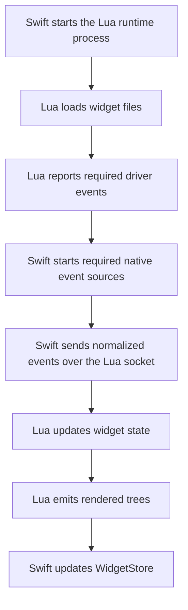

# Lua Runtime Overview

This section explains how EasyBar runs Lua widgets internally.

It is for contributors. For the public widget API, see [Lua Widgets](../../lua/overview.md).

## Overview

EasyBar does not embed Lua in-process.

It starts a separate Lua process and communicates with it over a dedicated Unix socket, while keeping stderr reserved for logs.

That gives the project:

- crash isolation
- simpler reloads
- clean widget state reset on restart
- plain JSON transport between Swift and Lua
- transport isolation from process logs

## High-level flow

1. Swift starts the Lua runtime process.
2. Lua loads every widget file from the widget directory.
3. Lua reports which driver events it needs.
4. Swift starts only those event sources.
5. Swift sends normalized events to Lua as JSON lines over the Lua socket.
6. `EasyBarLuaRuntime` connects that socket and then execs Lua, so the Lua runtime still speaks line I/O while Swift owns the socket lifecycle.
7. Lua updates widget state and emits rendered trees as JSON lines over that same socket.
8. Swift decodes those trees and updates the UI store.

## Main Swift pieces

- `LuaProcessController.swift`
  starts and stops the Lua process
- `LuaTransport.swift`
  owns the dedicated Lua socket plus stderr log handling
- `EasyBarLuaRuntime`
  connects the configured Lua socket and then execs the Lua interpreter
- `LuaLogBridge.swift`
  converts structured Lua stderr lines into normal Swift logs
- `LuaRuntime.swift`
  small facade over process and socket transport
- `WidgetEngine.swift`
  owns the runtime handshake, subscriptions, and tree updates
- `EventHub.swift`
  sends app and widget events to both Swift listeners and Lua
- `EventManager.swift`
  starts only the native event sources Lua actually subscribed to
- `RuntimeCoordinator.swift`
  owns startup, shutdown, reload, file watching, and socket-command orchestration
- `WidgetStore.swift`
  stores the latest rendered node trees

## Main Lua pieces

- `runtime.lua`
  runtime bootstrap and main loop over socket-backed stdin/stdout
- `loader.lua`
  loads widget files into isolated environments
- `api.lua`
  public `easybar` API, node handles, and registry bridge
- `registry.lua`
  stores node state and applies property normalization
- `subscriptions.lua`
  owns node subscriptions and interval callbacks
- `events.lua`
  normalizes raw payloads and dispatches them
- `render.lua`
  converts registry state into flat node trees
- `json.lua`
  small JSON encoder/decoder
- `log.lua`
  structured stderr logging
