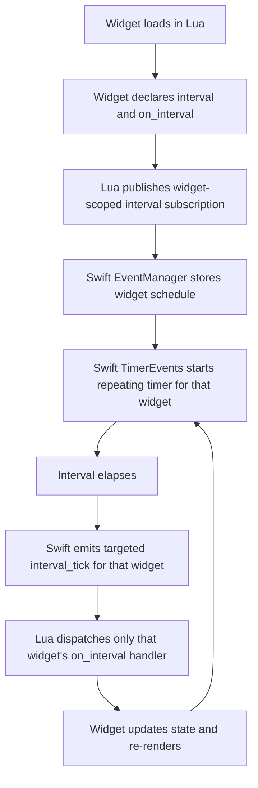

# Intervals

Use `interval` with `on_interval` when a widget needs to poll.

EasyBar schedules intervals per widget. If a widget sets `interval = 1800`,
the backend starts that widget's timer when the widget registers its interval
handler and fires `on_interval` 1800 seconds later, then every 1800 seconds
after that. It does not wait for the next wall-clock boundary.

```lua
local clock

clock = easybar.add(easybar.kind.item, "clock", {
    position = "right",
    order = 10,
    interval = 60,
    label = os.date("%H:%M"),
    on_interval = function()
        clock:set({
            label = os.date("%H:%M"),
        })
    end,
})
```

## Flow



## Timing semantics

- `interval = 60` means 60 seconds after registration, then every 60 seconds after that.
- Each widget owns its own cadence.
- Changing `interval` replaces that widget's schedule with a new one.
- Removing the widget removes its interval schedule.

## Referencing the node itself

When an interval callback needs to reference its own handle, declare the variable before assigning it:

```lua
local clock

clock = easybar.add(easybar.kind.item, "clock", {
    interval = 60,
    on_interval = function()
        clock:set({
            label = os.date("%H:%M"),
        })
    end,
})
```

Do not write this:

```lua
local clock = easybar.add(easybar.kind.item, "clock", {
    interval = 60,
    on_interval = function()
        clock:set({
            label = os.date("%H:%M"),
        })
    end,
})
```

The callback may close over `clock` before it has been assigned.

## When to use intervals

Use intervals for polling:

- package manager state
- shell command output
- API checks
- periodic time-based updates

Use event subscriptions for real events:

- `network_change`
- `wifi_change`
- `volume_change`
- `system_woke`
- mouse events
