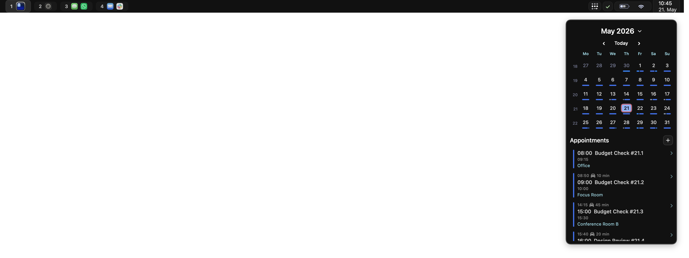
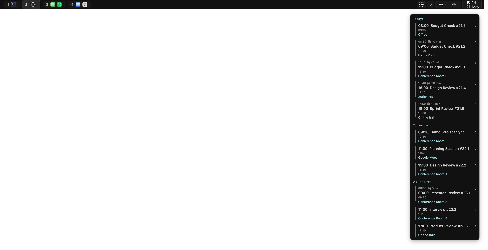

# EasyBar

EasyBar is a lightweight, scriptable macOS status bar built with SwiftUI and Lua.

It combines fast native widgets with flexible Lua widgets. Use built-ins for common system data, then add custom Lua widgets when you need something specific.

EasyBar is designed for a clean macOS workflow and integrates especially well with AeroSpace.

## Features

- Native macOS bar window built with SwiftUI
- Native built-in widgets plus Lua widgets
- Object-style Lua widget API with node handles
- AeroSpace integration for spaces, focused app state, and layout mode state
- Event-driven updates and interactive popups
- Calendar and network helper agents for permission-sensitive data
- Homebrew install and service workflow
- Logging and startup diagnostics for troubleshooting
- Lightweight runtime metrics

## Inspiration and scope

EasyBar is heavily inspired by [SketchyBar](https://github.com/FelixKratz/SketchyBar).

EasyBar is not meant to be a drop-in replacement. It is a more opinionated project that reflects a specific macOS setup and a few intentional trade-offs:

- EasyBar is built specifically around AeroSpace.
- There are no plans to support yabai.
- Native Swift code is preferred wherever possible.
- Lua is supported for custom widgets, but the core direction is Swift-first.

EasyBar shares some ideas with SketchyBar, but aims to be a different kind of tool: a personal, strongly opinionated macOS bar focused on native Swift UI, helper agents, and an AeroSpace-based workflow.

## Screenshots

### Calendar

### Upcoming

### CPU

### Front app

### Context menu

## Start here

- [Installation](getting-started/installation.md)
- [Configuration](configuration/overview.md)
- [AeroSpace Integration](getting-started/aerospace.md)
- [Lua Widgets](lua/overview.md)
- [Troubleshooting](runtime/troubleshooting.md)
